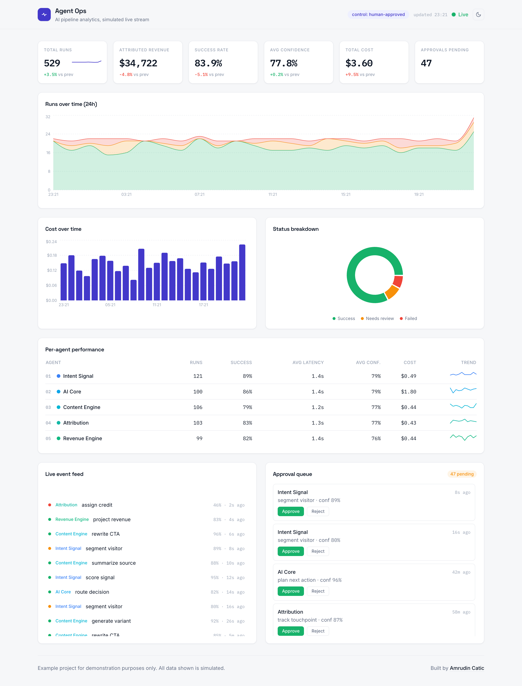
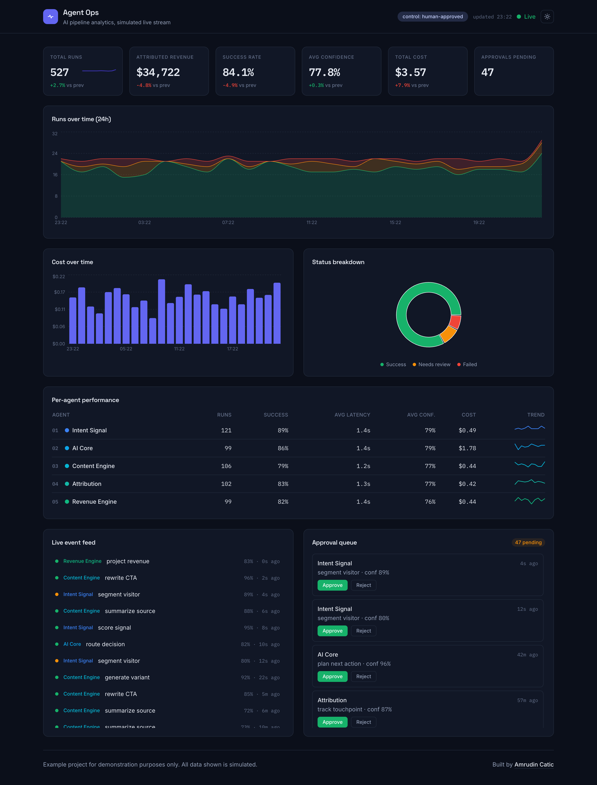

# Agent Ops

A clean, modern, single-page **analytics dashboard** that monitors a simulated live **AI agent pipeline**. Runs stream in real time while KPIs, charts, a per-agent table, a live event feed, and a human-approval queue all update as the pipeline works.

**Live demo: https://amrudincatic.github.io/agent-ops-dashboard/**

> **This is an example project, built for demonstration purposes only.** It is a compact proof-of-work piece that shows the kind of dashboard and analytics setup I build for clients. There is no backend and no real data: everything you see is generated locally and simulated, so the dashboard is self-contained and always shows a live, populated view.



<details>
<summary>Dark theme</summary>



</details>

## Table of contents

- [What it is](#what-it-is)
- [What it shows](#what-it-shows)
- [The pipeline](#the-pipeline)
- [How it works](#how-it-works)
- [Tech stack](#tech-stack)
- [Getting started](#getting-started)
- [Project structure](#project-structure)
- [Testing](#testing)
- [Design notes](#design-notes)
- [Scope and limitations](#scope-and-limitations)
- [License](#license)
- [Author](#author)

## What it is

Agent Ops is an operations console for an AI agent pipeline. Imagine a set of AI agents that work together to turn a visitor into revenue: one detects intent, one reasons and orchestrates, one generates content, one tracks attribution, and one computes attributed revenue. This dashboard is the instrument panel that watches them run.

The point of the project is to demonstrate, end to end and in one small repository, how a real analytics dashboard is put together: modeling the data, deriving metrics from it, keeping the view live, and presenting it with a clear, intentional design.

## What it shows

Everything on the page is derived from a single log of agent "runs". The layout is one dense page with these areas:

- **KPI row.** Six headline metrics, each with a change versus the previous period:
  - **Total runs** in the last 24 hours (with a sparkline).
  - **Attributed revenue**, the total revenue the pipeline attributed in the window.
  - **Success rate**, the share of runs that succeeded.
  - **Avg confidence**, the mean confidence score across runs.
  - **Total cost**, the summed token cost in dollars.
  - **Approvals pending**, how many runs are waiting for human review.
- **Runs over time (24h).** An area chart of runs per hour, stacked by status (success, needs review, failed).
- **Cost over time.** Hourly token cost as bars.
- **Status breakdown.** A donut of success vs. needs-review vs. failed.
- **Per-agent performance.** A table with one row per agent (numbered 01 to 05 in pipeline order), showing runs, success rate, average latency, average confidence, cost, and a trend sparkline.
- **Live event feed.** The newest runs stream in every couple of seconds and animate in, each showing the agent, the action, its confidence, and how long ago it happened.
- **Approval queue.** Runs flagged as "needs review" appear here with Approve and Reject buttons. Acting on one removes it from the queue and updates the "Approvals pending" KPI.

There is also a **light and dark theme** toggle in the header (it follows your system preference by default and remembers your choice).

## The pipeline

The five agents mirror the live diagram on [amrudincatic.com](https://amrudincatic.com):

```
intent-signal  ->  ai-core  ->  content-engine  ->  attribution  ->  revenue-engine
```

Each run belongs to one agent and produces a decision with:

- a **confidence** score (0 to 1),
- a **token cost** (and the dollar cost derived from it),
- a **latency** in milliseconds,
- a **status**: `success`, `failed`, or `needs-review`,
- and, for successful `revenue-engine` runs, an **attributed revenue** amount.

The five agents share a blue-to-green color sequence throughout the UI, so color encodes pipeline order: signal at the blue end, revenue at the green (money) end.

## How it works

There is no server. The whole dashboard runs in the browser and is driven by two ideas: a reproducible history and a live stream.

1. **Seeded history.** On load, `src/data/seed.ts` uses a seeded pseudo-random generator (mulberry32) to build roughly 24 hours of run history. Because it is seeded, the generated history is deterministic and reproducible rather than random noise.
2. **Live simulation.** `src/data/simulator.ts` emits a new run on an interval (about every 2 seconds). A hook (`src/store/useLiveStream.ts`) appends each new run to the store, which is what makes the dashboard feel alive.
3. **A single source of truth.** A small [Zustand](https://github.com/pmndrs/zustand) store (`src/store/useDashboardStore.ts`) holds the run log and two actions: add a run, and resolve an approval.
4. **Derived metrics.** Every metric, chart series, and table row is computed from the run log by pure functions in `src/data/aggregations.ts` (KPIs and deltas, hourly buckets, per-agent rollups, the status breakdown, and the approval queue). These functions are unit tested.
5. **Presentation.** Components in `src/components/` render the derived data. Color and formatting live in `src/lib/` so the UI stays consistent. Theme tokens are CSS variables that switch under a `.dark` class, so both light and dark themes (including the charts) come from one token set.

## Tech stack

| Concern        | Choice                                  |
| -------------- | --------------------------------------- |
| Framework      | React 18 + Vite                         |
| Language       | TypeScript (strict mode)                |
| Styling        | Tailwind CSS (variable-driven theming)  |
| State          | Zustand                                 |
| Charts         | Recharts, plus inline SVG sparklines    |
| Fonts          | Space Grotesk, Inter, IBM Plex Mono (self-hosted) |
| Tests          | Vitest                                  |

## Getting started

Requires Node.js 18 or newer.

```bash
npm install
npm run dev      # start the dashboard, then open the printed localhost URL
npm test         # run the unit tests
npm run build    # typecheck and build for production
npm run lint     # lint
```

## Project structure

```
src/
  data/        types, agent registry, seeded history, aggregations, live simulator
  store/       Zustand store, live-stream hook, theme hook
  lib/         formatting helpers, color tokens
  components/  Header, KPI row, charts, agent table, event feed, approval queue, footer, theme toggle
  App.tsx      page layout and derived state
docs/
  DESIGN.md    the design document
  PLAN.md      the step-by-step implementation plan
  screenshot*  light and dark screenshots
CLAUDE.md      project notes and conventions
progress.md    a running build journal
```

## Testing

The data layer is unit tested with Vitest. Tests cover:

- **Seed determinism**: the same seed produces the same history.
- **Aggregations**: KPIs, deltas, per-agent rollups, status breakdown, hourly bucketing, and the approval queue compute correctly from known fixtures.
- **Formatting**: currency, percentage, duration, and relative-time helpers.
- **Store**: appending runs, the run-log cap, and resolving approvals.

```bash
npm test
```

## Design notes

The visual direction is a clean, modern, light-first analytics aesthetic (with a dark theme), chosen for broad, professional readability. A few deliberate choices:

- **Numbers are set in a monospace face** (IBM Plex Mono) for an instrument-like precision.
- **Agent colors form a blue-to-green sequence** that encodes pipeline order.
- **Flat, hairline-bordered cards** and a sticky, blurred header keep the focus on the data.
- Accessibility basics are handled: visible keyboard focus, reduced-motion support, and text (not color alone) for status where it matters.

See `docs/DESIGN.md` for the full design and `docs/PLAN.md` for the build plan.

## Scope and limitations

This is intentionally scoped as a proof-of-work, not a production system:

- No backend, authentication, persistence, or routing.
- All data is simulated in the browser; nothing is sent anywhere.
- No analytics or tracking of the viewer.

## License

Released under the [MIT License](LICENSE). You are free to use the code as a reference or starting point.

## Author

Built by **[Amrudin Catic](https://amrudincatic.com)**. Growth systems, marketing engineering, and AI.

This repository is an example of my work and is shared for demonstration purposes.
